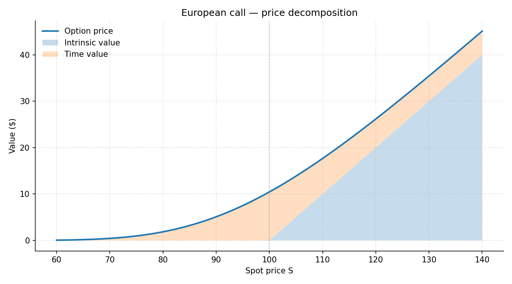
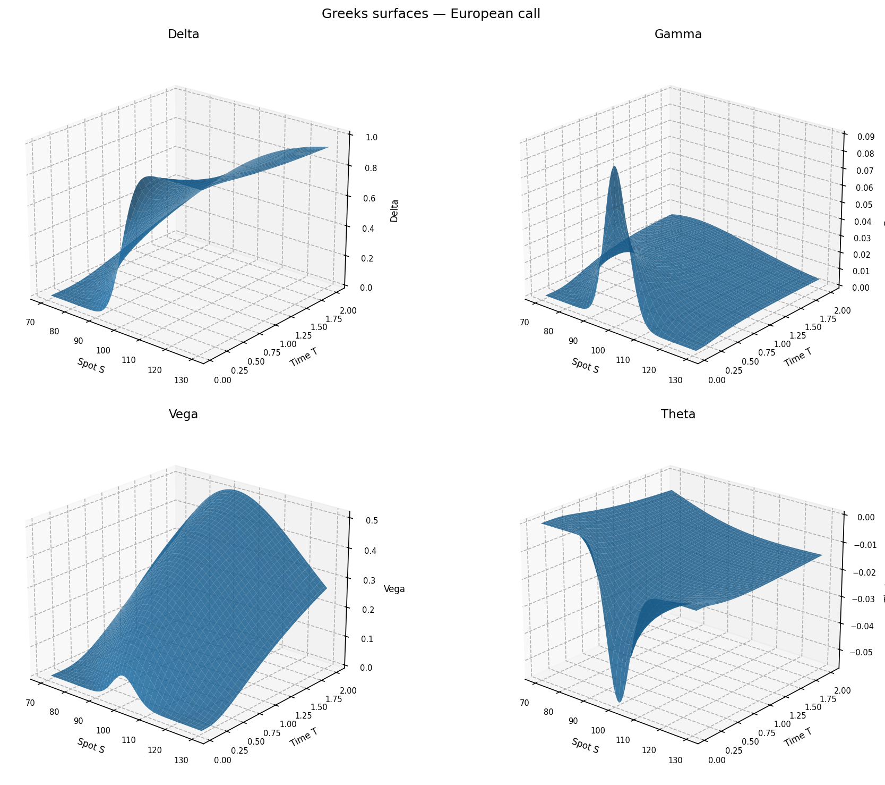
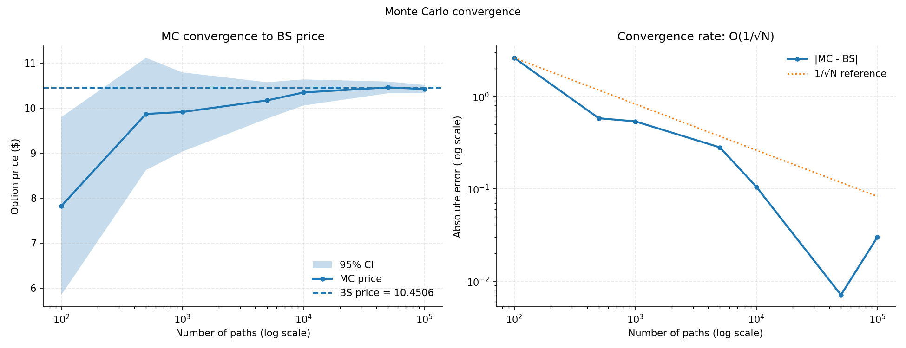
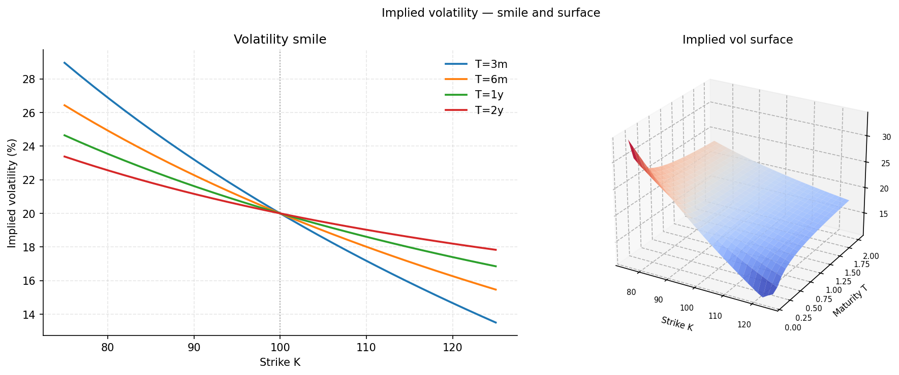

# Options Pricing Engine

A Python implementation of European option pricing via Black-Scholes analytics, 
Monte Carlo simulation, and implied volatility inversion.

---

## Modules

| File | Description |
|---|---|
| `bs_pricer.py` | Analytical Black-Scholes pricer for European calls and puts, with put-call parity verification |
| `greeks.py` | All five Greeks analytically, validated against finite differences to 1e-9 |
| `mc_pricer.py` | Monte Carlo pricer with antithetic variates and convergence study |
| `iv_solver.py` | Implied vol inversion via Newton-Raphson with Brent fallback, synthetic vol smile |
| `visualizations.py` | Four publication-quality figures |


---

## The math

Under risk-neutral dynamics the asset follows geometric Brownian motion:

$$dS = rS\,dt + \sigma S\,dW_t$$

The Black-Scholes formula prices a European call as:

$$C = S \cdot N(d_1) - Ke^{-rT} \cdot N(d_2)$$

where:

$$d_1 = \frac{\ln(S/K) + (r + \sigma^2/2)\,T}{\sigma\sqrt{T}}, \qquad d_2 = d_1 - \sigma\sqrt{T}$$

The Monte Carlo price is the discounted expected payoff over $N$ simulated paths:

$$V \approx e^{-rT} \cdot \frac{1}{N}\sum_{i=1}^{N} \max(S_T^{(i)} - K,\, 0), \qquad \text{error} \sim O(1/\sqrt{N})$$

Implied volatility is recovered by inverting the BS formula using Newton-Raphson:

$$\sigma_{n+1} = \sigma_n - \frac{C_{BS}(\sigma_n) - C_{mkt}}{\mathcal{V}(\sigma_n)}$$

---

## Setup

\```bash
git clone https://github.com/thegreatlol/options-pricer.git
cd options-pricer
pip install -r requirements.txt
python visualizations.py
\```

---

## Results


*Total option price = intrinsic value + time value. Time value peaks ATM and falls to zero deep ITM and OTM.*


*Greeks as functions of spot and time to expiry. Note the gamma spike near ATM at low T — this is when delta-hedging is most expensive.*


*Monte Carlo convergence to BS price. Error decays as O(1/√N) as shown on the log-log scale.*


*Implied vol smile across strikes for four maturities. Skew steepens for shorter maturities — near-term crash risk is priced more acutely.*

---

## Key results

- Put-call parity residual: 0.00e+00
- Greeks validated against finite differences: residuals < 1e-9
- IV inversion residual: < 1e-10 across all tested vol levels
- MC price with N=100,000: within 95% CI of BS price 10.4506

---

## Extensions

- American options via Longstaff-Schwartz Monte Carlo
- Heston stochastic volatility model
- SABR model for vol surf